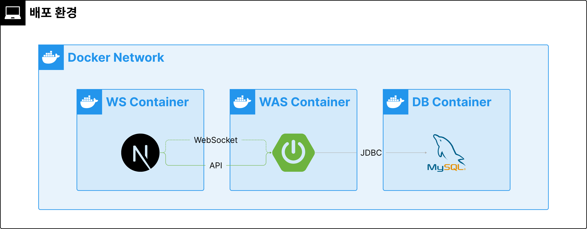

# 🚀 Woori CodeShare 배포 가이드

## 📋 개요



Woori CodeShare는 코드 공유 플랫폼으로, Docker Compose를 사용하여 Next.js 클라이언트, Spring Boot 서버, MySQL 데이터베이스를 통합 배포할 수 있습니다.

## 🛠️ 시스템 요구사항

### 필수 소프트웨어

- **Docker** (Docker Desktop 권장)
- **Git**
- **인터넷 연결** (GitHub 저장소 클론용)

## 🚀 빠른 시작

### 1. 저장소 클론

```bash
git clone https://github.com/woori-codeshare/deploy.git
cd deploy
```

### 2. 실행 권한 부여

```bash
chmod +x deploy.sh
```

### 3. 전체 시스템 배포

```bash
./deploy.sh start
```

## 📂 프로젝트 구조

```
.
├── deploy.sh              # 메인 배포 스크립트
├── scripts/               # 모듈화된 스크립트들
│   ├── common.sh          # 공통 유틸리티 함수
│   ├── repositories.sh    # GitHub 저장소 관리
│   ├── docker.sh          # Docker 관련 기능
│   ├── dependencies.sh    # 의존성 관리
│   └── setup.sh           # 환경 설정 파일 생성
├── docker-compose.yml     # Docker Compose 설정 (자동생성)
├── db/                    # 데이터베이스 초기화 스크립트 (자동생성)
├── client/                # Next.js 클라이언트 (자동 클론)
└── server/                # Spring Boot 서버 (자동 클론)
```

## 🌐 서비스 접속 정보

배포 완료 후 다음 주소로 접속할 수 있습니다:

| 서비스                | URL                                         | 설명                 |
| --------------------- | ------------------------------------------- | -------------------- |
| **메인 애플리케이션** | http://localhost:3000                       | Next.js 클라이언트   |
| **API 서버**          | http://localhost:8080                       | Spring Boot REST API |
| **API 문서**          | http://localhost:8080/swagger-ui/index.html | Swagger UI           |
| **헬스체크**          | http://localhost:8080/actuator/health       | 서버 상태 확인       |
